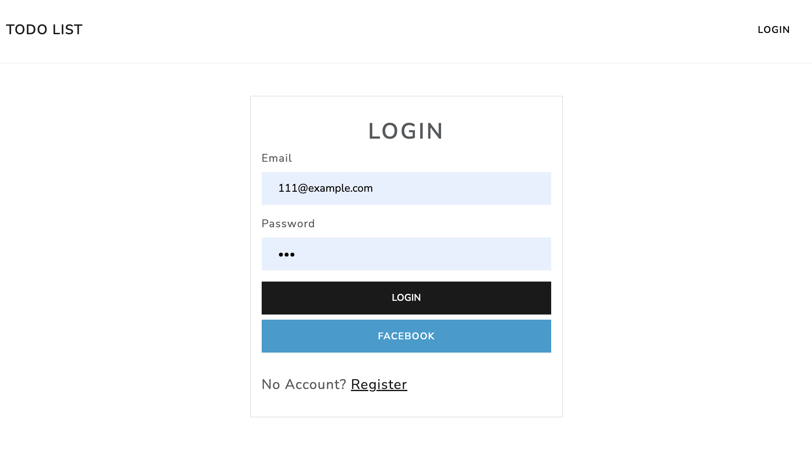

# A14 : TODO List x Sequelize


## Screenshot - 畫面截圖



## About - 介紹
使用Express跟MySQL做的TODO清單


## Features - 功能

1. 使用者可以註冊，登入，登出
2. 只用者可以CRUD Todo 資料


## Installation and execution - 安裝與執行步驟

1.開啟Terminal, clone此專案至本機:
```
git clone https://github.com/klu0926/todos-list-sequelize.git
```

2.進入存放此專案的資料夾
```
cd todo-list-SQL2
```

3.安裝 npm 套件
```
npm install
```

4.安裝nodemon (如果已有可跳過)
```
npm install -g nodemon
```

5.建立專案資料庫：開啟 Workbench，在新的 Query那輸入
```
drop database if exists todo_sequelize; 
create database todo_sequelize; 
use todo_sequelize;
```

6.使用 Migrations 在資料庫建立 schema 
```
npx sequelize db:migrate
```

7.製作種子資料
```
npx sequelize db:seed:all
```
8.製作 .env檔案可以參考 .env.example
```
PORT=
SESSION_SECRET=
FACEBOOK_APP_CALLBACK=
FACEBOOK_APP_ID=
FACEBOOK_APP_SECRET=
```

9.啟動伺服器 (使用 nodemon)
```
npm run dev 
```

10.當 terminal 出現以下字樣，表示伺服器已啟動並成功連結
```
server live on http://localhost:PORT
```


## Development Tools - 開發工具
* Node.js
* Express
* Bootstrap
* MySQL
* mysql2
* sequelize
* sequelize-cli
* bcryptjs
* connect-flash
* express-handlebars
* express-session
* mongoose
* passport
* passport-facebook
* passport-local

